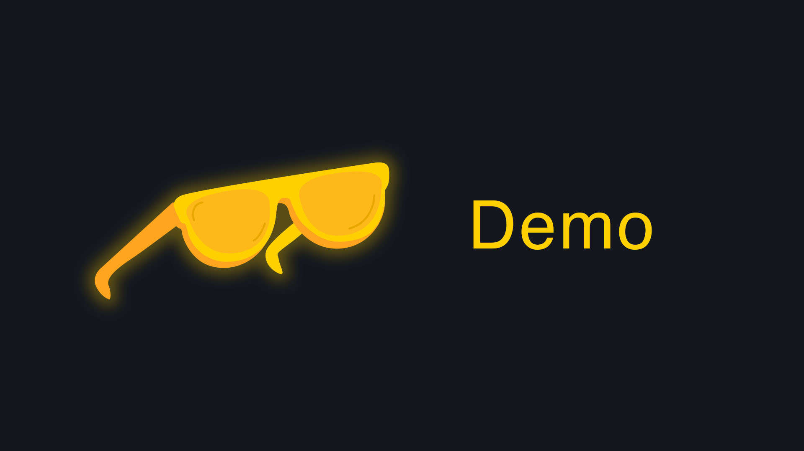

# React & Roll

## Table of Contents
- [About the Project](#about-the-project)
- [Technologies Used](#technologies-used)
- [Features](#features)
- [Installation](#installation)
- [Usage](#usage)
- [Project Structure](#project-structure)
- [Credits](#credits)
- [License](#license)

## About the Project
This project is a responsive portfolio site built with React to showcase my work in videography, design, and development. The goal is to create a dynamic and visually cohesive portfolio, emphasizing a mobile-first design with customized Bootstrap styling.

## Technologies Used
- **React** – For building reusable UI components and managing the front-end logic
- **React Router** – For client-side navigation within the app
- **Bootstrap** – To streamline styling and layout with responsive design principles
- **CSS Modules** – For styling components with a modular approach

## Features
- **Responsive Design** – Designed with a mobile-first approach to ensure compatibility on all devices.
- **Customizable Navigation Bar** – Includes links aligned to the right with my name/logo on the left.
- **Cohesive Styling** – Consistent color schemes and typography across the site for a professional look.
- **Dynamic Components** – Built using `Header`, `Footer`, and `Navigation` components, with reusable styles.

## Video Demo
## Demo

[](https://drive.google.com/file/d/1KzgtFg_I-igKDsE3WeEaQslTzVLvSIGA/view?usp=drive_link)


## Installation
1. Clone the repository:
   ```bash
   git clone https://github.com/yourusername/react-portfolio.git

   npm install

   npm run build
   ```

GitHub: JakeStair
Email: jacob.watson00@yahoo.com

## Credits

This project was built as part of a React Challenge. I want to thank TA David Park from the EdEx Bootcamp for his contributions.

## License

This project is licensed under the MIT License.


